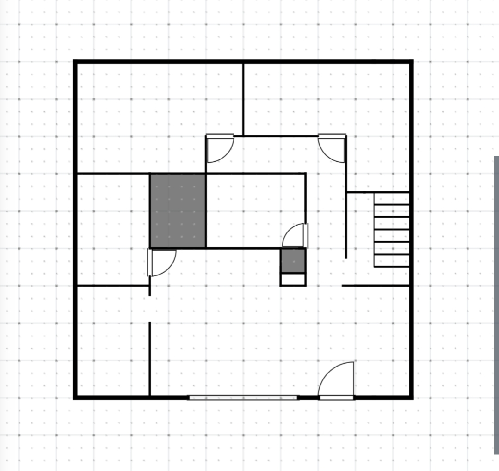

# 第二十九章 猫娘观察日记

一猫一狐吃完饭，把包装揉成一团丢进垃圾桶。

这家外卖包装设计的很好，没有弄脏什么东西。

门外的天色早已黑透。茉璃家木门两侧挂着两盏遮檐小壁灯，在屋前的空地上泼下一小片暖融融的昏黄光晕，将不远处静立的树影勾勒出朦胧的轮廓。山风拂过林梢，幽暗深邃的树丛间，正有点点幽微清透的荧光在半空中四散翩跹、明灭不定。

起初浅紫还以为这也是茉璃造的生物，许久才回想起来本就存在萤火虫这个物种。

不过……自己确实已经好多年没在现实里见过活的萤火虫了。浅紫回忆着，她上一次见到这种屁股发光的小虫好像还是在几岁的时候。

萤火虫对水质、土壤乃至光照极其挑剔，按常理绝不可能在距离繁华市区不过几百米的近郊存活繁衍。思来想去，多半还是茉璃动的手脚。

走出门外，这里的夜色当真好得出奇。墨绿色的林海如同一道天然的环形屏障，将这栋小屋严严实实地护在山谷怀抱之中；深吸一口气，微凉湿润的空气里，竟幽幽泛着一丝似有若无的桂花清甜。那香气并不浓烈扑鼻，反倒像是被夜露浸透后、借着山风徐徐送来的冷香。

顺着风声侧耳细听，那是屋后小溪穿林越石的潺潺流水声。水流并不湍急，清冽的山泉在圆润的卵石与青苔间跌撞激荡，激起阵阵如碎玉碰击般的脆响，伴随着不远处竹林树梢被风拂过的沙沙絮语，在幽邃的夜幕下交织成一片令人心安的自然之音。

绕过房屋来到小溪前。溪边的卵石颇为湿滑，浅紫放慢脚步，小心翼翼地靠近。她在溪畔蹲下身，伸出手掌轻轻触碰水流，指尖顿时传来一股冰冰凉凉的触感。

她沉下心神，手臂缓慢上抬，一颗凝练浑圆的水球随之自水面升起，稳稳悬浮在手掌下方。浅紫冷不丁加快动作，扬手将水球奋力投掷而出。

啪的一声，水球在不远处的树梢上炸散成漫天水雾，顿时惊得枝桠间栖息的一群夜鸟惊叫连连，扑棱着翅膀仓皇飞向夜空。

没玩上一会儿水，昏暗的天空中就划过一道响雷。

浅紫有些纳闷，心想来的时候天色还只是多云，顺手从兜里掏出手机查看天气。

“19：00～20：00，中到大雨。”

即使是深秋，亚热带沿海山区的阵雨依然是说来就来，眼看山风渐大，浅紫赶忙收身折返回前门。

回到屋内，没看到茉璃。

浅紫踩着木阶上楼，来到茉璃的卧室门前，轻轻敲了敲门。

……

门内没有回应，看来并不在房间里。

浅紫折返回一楼，正好瞧见茉璃正站在走廊内的拐角处。

浅紫这才发现一楼的走廊居然也有一个拐角。先前自己刚被捡回来时住的客房就在厨房隔壁，以至于她一直没有注意到茉璃这栋房子的结构原来这么复杂。

楼梯间正对面的门后是一楼的卫生间，而拐角深处，还能看到一扇门。

浅紫来到茉璃身边，茉璃手里正拎着一只沉甸甸的盒子。

“你忘记拿走了喵。”

浅紫接过盒子，里面正是之前自己用的那套设备。

“谢谢。”

浅紫抱着盒子，抬头看了看走廊尽头的那扇门，还有此时手边的那一扇，忍不住问道：“这两间房是干什么的？”

“也是空的喵。”茉璃语气平淡地应道。

……

外面的雨越下越大，水幕倾泻，这下撑着雨伞都不一定能干着回去了。

反正也不急着赶路，就多坐会儿吧。

见浅紫暂时不打算走，茉璃领着她回到二楼卧室，拉开桌下抽屉拿出一台笔记本电脑。

“来玩会儿呗喵~”

“好。”浅紫接过电脑，开机登录上自己的账号。

领着浅紫来到自己的卧室，借台式机后头的网线一用，插上网线后下载速度立马飞涨，短短十分钟便下载完毕。

浅紫盯着任务管理器，她感觉这个瓶颈还只是在这电脑的2.5G网卡。

玩VR游戏要是两个人挤一间房，挥手踢腿总怕误伤，放不开手脚。

插上电源，浅紫把电脑竖着靠在墙根放好，防止踩到。

绑好手脚的定位追踪器，浅紫扣上头显，视野骤然暗下，紧接着再次亮起了熟悉的登录过场。

『裁梦为魂，万象由心』

『请选择游戏模式』

『单人游戏』

『多人游戏』

『设置』『退出』

没有了初次登陆的新手引导，二次登录的主界面直白利落。

浅紫抬手点中“多人游戏”。

屏幕上弹出了置顶的官方服：

『幻世』

确认进入！

短暂的黑暗散去，身旁的喧嚣声扑面而来，画面瞬间回到了上次不夜城的下线地点。

浅紫环顾四周，城里才刚刚黄昏，一轮红日正慢悠悠往天边掉。这官方服务器的时间同步现实，只是锚定的是望城的时区，而望城位于星月湾西侧数千公里。

似曾相识的景象总让她联想起前夜的高台梦境。但那场幻梦并未伤及她分毫，反倒激发出不少灵感，仔细想来，确实没什么值得害怕的。

身旁亮起一团流光溢彩的登入特效，如碎星般的光晕在半空中层层散开。待绚丽的光华徐徐敛去，一袭玄黑织金锦裙、身披落樱羽衣的茉璃已俏生生立在身侧。

不得不说，这游戏AI根据“愿景”捏出来的衣装，审美确实挑不出毛病。

在不夜城的大街小巷一通玩耍，忽然，两捆沉甸甸的竹简不偏不倚地跌进两人掌心。

『“愿借千秋三更雪，换得不夜万盏灯。临江水榭，静候佳客。”

适逢不夜天都一年一度「千秋节」庆典，城主府谨设流光大醮，诚邀四海云游侠士同赴此夜盛景：』

【开演吉时】：今夜戌正（21:00）

【盛典主台】：临江天街

“去看看喵？”

“走吧”浅紫拦下路边的一辆马车。